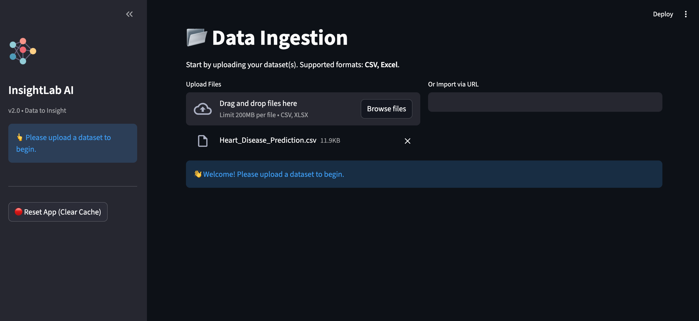
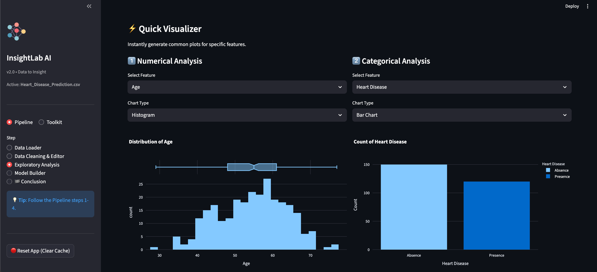

# InsightLab AI 🧪

**InsightLab AI** is a low-code Machine Learning platform built with Streamlit. It bridges the gap between raw data and actionable AI insights, allowing users to clean, analyze, and model data without writing code.


<div align="center">
  
</div>

## 🚀 Features

### The Pipeline (Linear Flow)
1.  **Data Loader**: Upload CSV/Excel or import via URL.
2.  **Data Cleaning & Editor**: Interactive Excel-like grid to edit values, handle missing data, and remove duplicates.
3.  **Exploratory Analysis**: Automated deep profiling and "Data Story".
    <div align="center">
      
    </div>
4.  **Model Builder**: Train Regression or Classification models (Linear, RandomForest, XGBoost, etc.).
    <div align="center">
      
    </div>
5.  **Conclusion**: Interactive prediction playground and Smart Model Export.

### The Toolkit (Utilities)
-   **Merge Studio**: Join multiple datasets.
-   **Model Runner**: Run predictions on exported "InsightLab Smart Models" independently.

### Core Capabilities
-   **Session Persistence**: Your work is auto-saved. Refresh without fear.
-   **Smart Bundles**: Exported models include schema metadata for easy reuse.
-   **Interactive UI**: Clean, responsive interface with sidebar navigation.

## 🛠️ Setup

1.  **Clone the repository**:
    ```bash
    git clone https://github.com/yourusername/insightlab-ai.git
    cd insightlab-ai
    ```

2.  **Create a virtual environment**:
    ```bash
    python -m venv venv
    source venv/bin/activate  # On Windows: venv\Scripts\activate
    ```

3.  **Install dependencies**:
    ```bash
    pip install -r requirements.txt
    ```

4.  **Run the application**:
    ```bash
    streamlit run app.py
    ```

## 📄 License
This project is licensed under the MIT License - see the [LICENSE](LICENSE) file for details.
